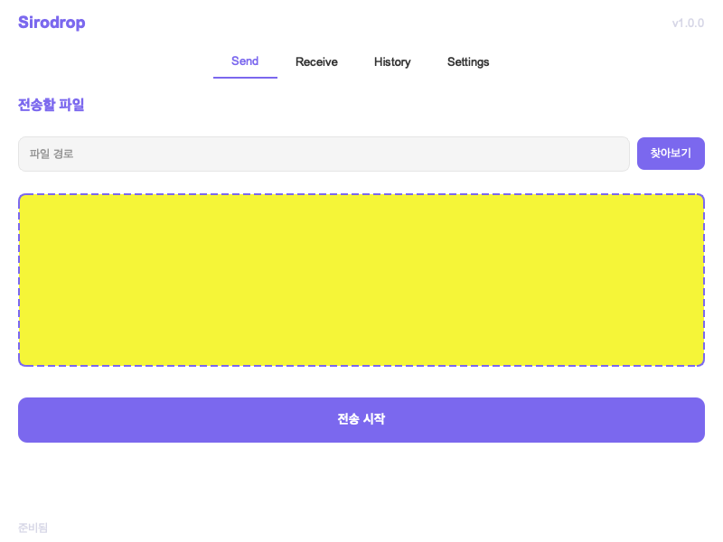
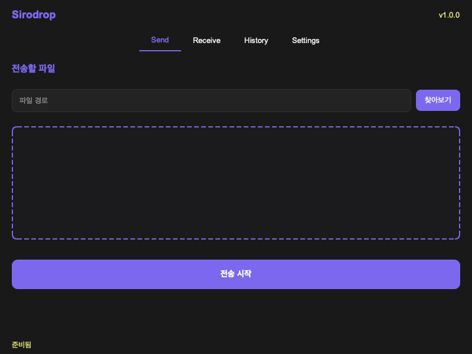

# 🌐 Sirodrop

<div align="center">
  
  <h3>모던하고 직관적인 파일 전송 도구</h3>
  
  [](https://opensource.org/licenses/MIT)
  [](https://www.python.org/)
  [](https://www.qt.io/)
  [](https://github.com/schollz/croc)
  
</div>

<p align="center">
  <a href="#-소개">소개</a> •
  <a href="#-주요-기능">주요 기능</a> •
  <a href="#-스크린샷">스크린샷</a> •
  <a href="#-설치">설치</a> •
  <a href="#-사용-방법">사용 방법</a> •
  <a href="#-기술-스택">기술 스택</a> •
  <a href="#-기여하기">기여하기</a>
</p>

## 📖 소개

**Sirodrop**은 [croc](https://github.com/schollz/croc) 명령줄 도구를 위한 현대적이고 직관적인 GUI 인터페이스입니다. croc은 컴퓨터 간에 파일을 손쉽고 안전하게 전송할 수 있는 도구이며, Sirodrop은 사용자 친화적인 인터페이스를 통해 이 기능을 훨씬 더 접근하기 쉽게 만들었습니다.

> 💡 **Sirodrop은 현대적인 디자인과 직관적인 사용성을 결합하여 파일 전송 경험을 향상시킵니다.**

## ✨ 주요 기능

<div align="center">
  <table>
    <tr>
      <td align="center"><h3>🎨</h3> <b>직관적인 UI</b></td>
      <td align="center"><h3>🔐</h3> <b>안전한 전송</b></td>
      <td align="center"><h3>📁</h3> <b>드래그 앤 드롭</b></td>
    </tr>
    <tr>
      <td>깔끔하고 현대적인 인터페이스로<br>누구나 쉽게 사용 가능</td>
      <td>종단간 암호화로 파일을<br>안전하게 전송</td>
      <td>파일과 폴더를 쉽게<br>끌어다 놓기 가능</td>
    </tr>
    <tr>
      <td align="center"><h3>🌙</h3> <b>다크 모드</b></td>
      <td align="center"><h3>💻</h3> <b>크로스 플랫폼</b></td>
      <td align="center"><h3>🚀</h3> <b>빠른 전송</b></td>
    </tr>
    <tr>
      <td>눈의 피로를 줄이는<br>라이트/다크 테마 지원</td>
      <td>Windows, macOS,<br>Linux 모두 지원</td>
      <td>최적화된 알고리즘으로<br>빠른 파일 전송</td>
    </tr>
  </table>
</div>

## 📸 스크린샷

<div align="center">
  
  
  <p><i>왼쪽: 라이트 모드 / 오른쪽: 다크 모드</i></p>
</div>

## 🚀 설치

### 사전 요구사항

- Python 3.10 이상
- [croc](https://github.com/schollz/croc) 설치

### 빠른 설치

```bash
# 저장소 클론
git clone https://github.com/sioaeko/croc-gui.git
cd croc-gui

# 의존성 설치
pip install -r requirements.txt

# 실행
python main.py
```

<details>
<summary><b>🛠️ 상세 설치 가이드</b></summary>

1. **croc 설치하기**
   - Linux & macOS: `curl https://getcroc.schollz.com | bash`
   - Windows: [Release 페이지](https://github.com/schollz/croc/releases)에서 다운로드

2. **Python 환경 설정**
   ```bash
   # 가상 환경 생성 (선택 사항)
   python -m venv venv
   source venv/bin/activate  # Linux/macOS
   venv\Scripts\activate     # Windows
   ```

3. **Sirodrop 설치 및 실행**
   ```bash
   # 저장소 클론
   git clone https://github.com/sioaeko/croc-gui.git
   cd croc-gui
   
   # 의존성 설치
   pip install -r requirements.txt
   
   # 실행
   python main.py
   ```
</details>

## 📝 사용 방법

### 🚢 파일 보내기

<div align="center">
  <table>
    <tr>
      <td align="center" width="70"><b>1</b></td>
      <td>"Send" 탭으로 이동</td>
    </tr>
    <tr>
      <td align="center"><b>2</b></td>
      <td>파일을 드래그 앤 드롭하거나 "찾아보기" 버튼 사용</td>
    </tr>
    <tr>
      <td align="center"><b>3</b></td>
      <td>선택적으로 암호화 및 압축 옵션 설정</td>
    </tr>
    <tr>
      <td align="center"><b>4</b></td>
      <td>"전송 시작" 버튼 클릭</td>
    </tr>
    <tr>
      <td align="center"><b>5</b></td>
      <td>생성된 코드를 수신자와 공유</td>
    </tr>
  </table>
</div>

### 📥 파일 받기

<div align="center">
  <table>
    <tr>
      <td align="center" width="70"><b>1</b></td>
      <td>"Receive" 탭으로 이동</td>
    </tr>
    <tr>
      <td align="center"><b>2</b></td>
      <td>보낸 사람으로부터 받은 코드 입력</td>
    </tr>
    <tr>
      <td align="center"><b>3</b></td>
      <td>저장 위치 선택 (선택 사항)</td>
    </tr>
    <tr>
      <td align="center"><b>4</b></td>
      <td>"수신 시작" 버튼 클릭</td>
    </tr>
  </table>
</div>

## ⚙️ 커스터마이징

설정 탭에서 다음과 같은 옵션을 조정할 수 있습니다:

- 🎨 **UI 테마**: 라이트/다크 모드 전환
- 📂 **기본 저장 위치**: 수신된 파일의 기본 저장 경로 설정
- 🔄 **전송 옵션**: 암호화, 압축 등 기본 전송 옵션 설정

## 🔧 기술 스택

<div align="center">
  <table>
    <tr>
      <th align="center">
        
      </th>
      <th align="center">
        
      </th>
      <th align="center">
        
      </th>
    </tr>
    <tr>
      <td align="center"><b>Python</b></td>
      <td align="center"><b>PyQt6</b></td>
      <td align="center"><b>croc CLI</b></td>
    </tr>
  </table>
</div>

## 🤝 기여하기

기여는 언제나 환영합니다! 더 나은 Sirodrop을 만드는 데 도움을 주세요:

1. 저장소 포크
2. 기능 브랜치 생성 (`git checkout -b feature/amazing-feature`)
3. 변경사항 커밋 (`git commit -m 'Add some amazing feature'`)
4. 브랜치에 푸시 (`git push origin feature/amazing-feature`)
5. Pull Request 생성

## 📜 라이선스

[MIT License](LICENSE) © [sioaeko](https://github.com/sioaeko)

## 🙏 감사의 말

- [croc](https://github.com/schollz/croc) - Christian Muehlhaeuser 및 기여자들
- PyQt 팀과 커뮤니티
- 피드백과 지원을 제공해준 모든 사용자들

---

<div align="center">
  <sub>Made with ❤️ in Korea</sub>
</div>
